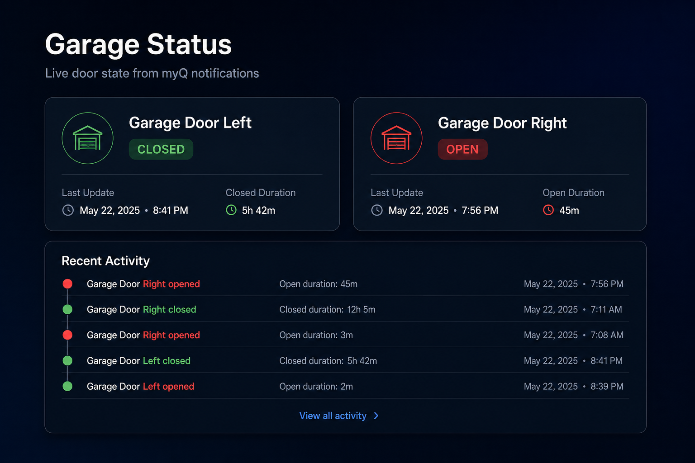

# myq-garage-worker

[](https://github.com/andrewtryder/myq-garage-worker/actions/workflows/deploy.yml)
[](https://github.com/andrewtryder/myq-garage-worker/releases)
[](LICENSE)

A Cloudflare Worker that integrates **myQ** notification emails and displays a clean, beautiful status dashboard. State is stored natively in Cloudflare KV.



For a step-by-step guide on how to configure MyQ, Cloudflare, and email forwarding, please see the [Setup Guide](SETUP.md).

> **Disclaimer:** This is an unofficial, community-maintained project. It is not affiliated with, endorsed by, or sponsored by Chamberlain Group, Inc. or its myQ brand. "myQ" is a trademark of its respective owner. This software is provided as-is, without warranty.

## Architecture

This worker acts as two endpoints:

1. **Email Routing Handler (`email`)**: Triggered when a myQ notification email is routed to the worker. It parses the sender and subject to extract device action (opened, closed, stopped) and logs the state.
2. **HTTP Handler (`fetch`)**: Serves a sleek, modern dashboard page displaying the current status of the garage doors retrieved directly from Cloudflare KV.

## Tech Stack

- **Runtime**: [Cloudflare Workers](https://workers.cloudflare.com/)
- **Codebase**: TypeScript, ESLint, Prettier
- **Storage**: [Cloudflare KV](https://developers.cloudflare.com/kv/)

## Security Recommendation

If you are using this worker for personal use, it is highly recommended to protect your public status page. You can easily do this by putting the worker behind [Cloudflare Zero Trust / Access](https://developers.cloudflare.com/cloudflare-one/applications/configure-apps/), restricting access to only your authorized emails or identity providers.

## Environment Variables / Configuration

The environment variable `GARAGE_DOORS` must be provided at deployment time or in the Cloudflare dashboard. We do not hardcode this in `wrangler.jsonc` to allow dynamic CI/CD deployments.

| Variable Name  | Description                                                                                                                                                                                               |
| -------------- | --------------------------------------------------------------------------------------------------------------------------------------------------------------------------------------------------------- |
| `GARAGE_DOORS` | A JSON object mapping the exact names of your garage doors (from the myQ app/emails) to specific KV keys.                                                                                                 |
| `API_KEY`      | _(Optional)_ A secret key to protect the status dashboard and JSON endpoints. If set, you must pass `?key=YOUR_KEY` in the URL or provide it via `Authorization: Bearer YOUR_KEY` or `x-api-key` headers. |

**Example configuration:**

```json
{
  "Garage Door Left": "garage-left",
  "Garage Door Right": "garage-right"
}
```

You also need to bind a KV Namespace to `GARAGE_STATE`. Run `npm run setup` to create one automatically, or see `wrangler.jsonc` for manual configuration.

## Setup and Deployment

We provide an interactive wizard to configure your garage doors, create the Cloudflare KV namespace, and deploy the worker:

1. Install dependencies:
   ```bash
   npm install
   ```
2. Run the interactive setup wizard:
   ```bash
   npm run setup
   ```

For a detailed step-by-step guide including Cloudflare Email Routing and myQ configuration, see the [Setup Guide](SETUP.md).

## Local Development

1. Install dependencies:

   ```bash
   npm install
   ```

2. Boot the local development server (remotely proxying to Cloudflare APIs):

   ```bash
   npm run dev
   ```

3. Open `http://localhost:8787` to view the local instance of the status page.

## Testing Live Deployments

To ensure your dashboard UI updates correctly without having to open/close your physical garage doors, we have built-in testing functionality:

### Option 1: Web UI Simulator

Open your deployed worker URL in a browser. At the top of the screen, switch to the **Simulator** tab.
You can use the form to enter a door name (exactly as configured), an action (opened, closed, stopped), and your API key (if set) to simulate an event. You can also paste the raw subject line from a real myQ notification email.

### Option 2: CLI Script

You can use the included CLI script from your terminal to ping the live (or local) worker:

```bash
# node scripts/test-live.js <URL> <DOOR_NAME> <ACTION> [API_KEY]
node scripts/test-live.js https://my-worker.workers.dev "Garage Door Left" opened
```

Both options talk to a dedicated `POST /simulate` endpoint which bypasses the strict email "From:" address validations but executes the exact same parsing and Cloudflare KV storage updates as a real email.

## Formatting & Linting

We maintain a strict code quality process:

- Linting check: `npm run lint`
- Formatting code: `npm run format`
- Type checking: `npm run typecheck`

## Continuous Integration / Deployment (CI/CD)

Deployments are automated through **GitHub Actions** when code is pushed to the `main` branch.

To set this up, add the following Repository Secrets in your GitHub repository (**Settings** -> **Secrets and variables** -> **Actions**):

- `CLOUDFLARE_API_TOKEN`: Your Cloudflare API Token (scoped to Edit Workers).
- `CLOUDFLARE_ACCOUNT_ID`: Your Cloudflare Account ID (e.g. `0123456789abcdef0123456789abcdef`).

Add the following Repository **Variable** (not secret):

- `KV_NAMESPACE_ID`: Your Cloudflare KV namespace ID for `GARAGE_STATE` (replaces the placeholder in `wrangler.jsonc` during CI deploy).
- `GARAGE_DOORS`: JSON object mapping door names to KV keys (already required for deploy).

## Integrations & Automations

This worker can automatically notify external services when a garage door is left open, or simply push status updates to external services like Home Assistant.

### Webhook Alerts (Left Open)

You can configure the worker to automatically check for doors left open for too long using Cloudflare Cron Triggers.

1. Configure the `WEBHOOK_URL` and `ALERT_OPEN_THRESHOLD_MINUTES` environment variables.
   - `ALERT_OPEN_THRESHOLD_MINUTES`: How many minutes the door must be open before sending an alert (defaults to 60).
   - `WEBHOOK_URL`: The destination URL to send the JSON alert payload to.
2. Ensure you have the `[triggers]` configuration uncommented in `wrangler.jsonc` to fire the cron job.

When triggered, the worker sends a standard `POST` request to the `WEBHOOK_URL` containing a JSON body:

```json
{
  "title": "Garage Door Alert",
  "message": "Garage Door Left has been open for 1 hr 15 mins.",
  "door": "Garage Door Left",
  "state": "OPEN",
  "durationMs": 4500000,
  "durationText": "1 hr 15 mins"
}
```

#### Apprise Integration

If you host an [Apprise API](https://github.com/caronc/apprise-api) container, you can fan-out notifications to Discord, Slack, SMS, Pushbullet, etc.
Set your `WEBHOOK_URL` to your Apprise topic endpoint, for example:
`WEBHOOK_URL = "https://apprise.mydomain.com/notify/garage"`

#### ntfy.sh Integration

[ntfy.sh](https://ntfy.sh/) is a simple HTTP-based pub-sub notification service. Since `ntfy.sh` supports receiving raw JSON via POST to standard topics, you can set your `WEBHOOK_URL` directly to your secret ntfy topic endpoint (though parsing might require a middleman or using ntfy's raw JSON publish features).
Alternatively, you can route the JSON payload through a service like `n8n` to translate the JSON into a clean Push notification.

#### Home Assistant Integration

For Home Assistant, use the companion **[ha-myq-garage](https://github.com/andrewtryder/ha-myq-garage)** custom integration (available via HACS). It polls this worker's JSON API and creates cover entities with config-flow setup — no manual REST sensor YAML required.

1. Deploy this worker and note your worker URL and optional `API_KEY`.
2. Install [ha-myq-garage](https://github.com/andrewtryder/ha-myq-garage) via HACS.
3. Add the integration in Home Assistant (**Settings → Devices & Services → Add Integration → MyQ Garage**).

**Advanced / fallback:** The API endpoint at `https://your-worker.workers.dev/?json=true` returns the current state and durations of all doors. You can poll it with the Home Assistant REST integration if you prefer a manual setup. The returned JSON looks like:

```json
{
  "doors": [
    {
      "name": "Garage Door Left",
      "state": { "value": "OPEN", "createdAt": "2023-10-01T12:00:00Z" },
      "durationMs": 3600000,
      "durationText": "1 hr"
    }
  ],
  "history": [ ... ]
}
```

## Contributing

See [CONTRIBUTING.md](CONTRIBUTING.md) for development setup and pull request guidelines.

## License

MIT — see [LICENSE](LICENSE).
