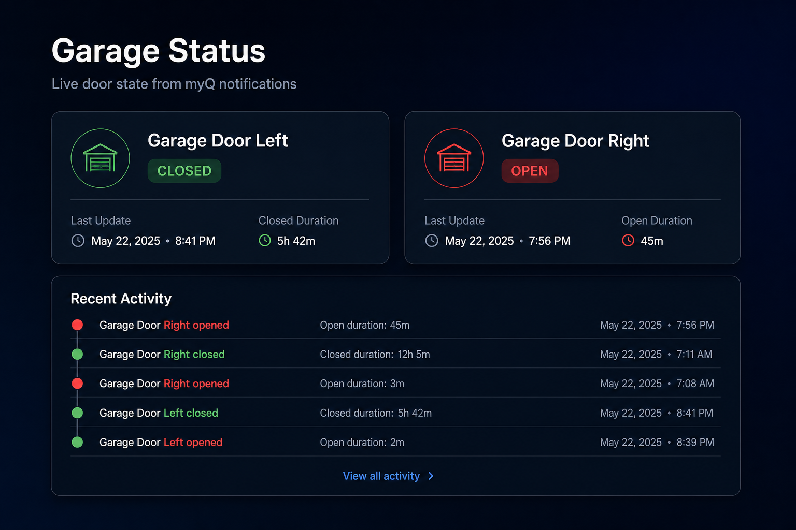

# myq-garage-worker

[](https://github.com/andrewtryder/myq-garage-worker/actions/workflows/deploy.yml)
[](https://github.com/andrewtryder/myq-garage-worker/releases)
[](LICENSE)

A Cloudflare Worker that integrates **myQ** notification emails and displays a clean, beautiful status dashboard. State is stored natively in Cloudflare KV.



For a step-by-step guide on how to configure MyQ, Cloudflare, and email forwarding, please see the [Setup Guide](SETUP.md).

> **Disclaimer:** This is an unofficial, community-maintained project. It is not affiliated with, endorsed by, or sponsored by Chamberlain Group, Inc. or its myQ brand. "myQ" is a trademark of its respective owner. This software is provided as-is, without warranty.

## Architecture

This worker acts as two endpoints:

1. **Email Routing Handler (`email`)**: Triggered when a myQ notification email is routed to the worker. It parses the sender and subject to extract device action (opened, closed, stopped) and logs the state.
2. **HTTP Handler (`fetch`)**: Serves a sleek, modern dashboard page displaying the current status of the garage doors retrieved directly from Cloudflare KV.

## Tech Stack

- **Runtime**: [Cloudflare Workers](https://workers.cloudflare.com/)
- **Codebase**: TypeScript, ESLint, Prettier
- **Storage**: [Cloudflare KV](https://developers.cloudflare.com/kv/)

## Security (operator responsibility)

**Browser dashboard access is not enforced inside this Worker.** Put the Worker behind [Cloudflare Zero Trust / Access](https://developers.cloudflare.com/cloudflare-one/applications/configure-apps/) with an Allow policy for humans. If Access is missing or misconfigured, anyone who knows the URL can view the dashboard and call Simulator/Alerts endpoints.

For Home Assistant (HACS), create a **second** Access application whose public destination is `your-hostname/devices` with a Bypass (Everyone) policy. Worker-destination Access apps (one-click Workers Access) have no path field, so a Bypass on that app would unprotect the whole Worker. Cloudflare lets a more specific `public` destination take precedence. Set the Worker `API_KEY` secret — after the bypass, that key is the **only** guard on `/devices`. The integration sends `Authorization: Bearer YOUR_API_KEY`. Without `API_KEY`, `/devices` returns 401.

Dashboard `POST /alert-config` and `POST /test-alert` include a soft Worker-side rate limit (UX only; fails open). For abuse prevention, configure Cloudflare Rate Limiting / WAF on those routes. See [SECURITY.md](SECURITY.md).

## Environment Variables / Configuration

The environment variable `GARAGE_DOORS` must be provided at deployment time or in the Cloudflare dashboard. We do not hardcode this in `wrangler.jsonc` to allow dynamic CI/CD deployments.

| Variable Name      | Description                                                                                                                                                                |
| ------------------ | -------------------------------------------------------------------------------------------------------------------------------------------------------------------------- |
| `GARAGE_DOORS`     | A JSON object mapping the exact names of your garage doors (from the myQ app/emails) to specific KV keys.                                                                  |
| `API_KEY`          | Secret required for machine status APIs (`GET /devices`, `GET /?json=true`). Send `Authorization: Bearer` or `x-api-key`. Not used for the browser dashboard (use Access). |
| `ALLOWED_EMAIL_TO` | _(Recommended)_ Exact envelope recipient (RCPT TO) that must match for inbound myQ mail. Rejects other aliases if set.                                                     |

**Example configuration:**

```json
{
  "Garage Door Left": "garage-left",
  "Garage Door Right": "garage-right"
}
```

You also need to bind a KV Namespace to `GARAGE_STATE`. Run `npm run setup` to create one automatically, or see `wrangler.jsonc` for manual configuration.

## Setup and Deployment

We provide an interactive wizard to configure your garage doors, create the Cloudflare KV namespace, and deploy the worker:

1. Install dependencies:
   ```bash
   npm install
   ```
2. Run the interactive setup wizard:
   ```bash
   npm run setup
   ```

For a detailed step-by-step guide including Cloudflare Email Routing and myQ configuration, see the [Setup Guide](SETUP.md).

## Local Development

1. Install dependencies:

   ```bash
   npm install
   ```

2. Boot the local development server (remotely proxying to Cloudflare APIs):

   ```bash
   npm run dev
   ```

3. Open `http://localhost:8787` to view the local instance of the status page.

## Testing Live Deployments

To ensure your dashboard UI updates correctly without having to open/close your physical garage doors, we have built-in testing functionality:

### Option 1: Web UI Simulator

Open your Access-protected worker URL in a browser. Switch to the **Simulator** tab, choose a configured door from the dropdown, and pick an action (opened, closed, stopped).

### Option 2: Alerts tab

Switch to the **Alerts** tab to configure a left-open webhook (stored in KV, used by the cron job every 15 minutes):

- **Webhook URL** — HTTPS only (ntfy, Pushover, Apprise, etc.; use a secret topic URL). Private/localhost destinations are rejected.
- **Threshold (minutes)** — how long a door must be open before alerting
- **HTTP method** — `POST` sends a JSON body; `GET` appends `title`, `message`, and other fields as query params (handy for ntfy.sh)
- **Save** — persists settings for the scheduled cron job
- **Test webhook** — sends a test notification immediately using the form values

Alerts fire once when the threshold is crossed for an open session (optional reminder interval can be configured via API). Closing the door clears the latch.

### Option 3: CLI Script

You can use the included CLI script from your terminal to ping the live (or local) worker:

```bash
# node scripts/test-live.js <URL> <DOOR_NAME> <ACTION>
node scripts/test-live.js https://my-worker.workers.dev "Garage Door Left" opened
```

Simulator and alert endpoints bypass the inbound email envelope-sender check but execute the same storage/alert logic as production.

## Formatting & Linting

We maintain a strict code quality process:

- Linting check: `npm run lint`
- Formatting code: `npm run format`
- Type checking: `npm run typecheck`

## Continuous Integration / Deployment (CI/CD)

Deployments are automated through **GitHub Actions** when code is pushed to the `main` branch.

To set this up, add the following Repository Secrets in your GitHub repository (**Settings** -> **Secrets and variables** -> **Actions**):

- `CLOUDFLARE_API_TOKEN`: Your Cloudflare API Token (scoped to Edit Workers).
- `CLOUDFLARE_ACCOUNT_ID`: Your Cloudflare Account ID (e.g. `0123456789abcdef0123456789abcdef`).

Add the following Repository **Variables** (not secrets):

- `KV_NAMESPACE_ID`: Your Cloudflare KV namespace ID for `GARAGE_STATE` (replaces the placeholder in `wrangler.jsonc` during CI deploy).

Add the following Repository **Secrets**:

- `GARAGE_DOORS`: JSON object mapping door names to KV keys (passed to the worker at deploy time).

## Integrations & Automations

This worker can automatically notify external services when a garage door is left open, or simply push status updates to external services like Home Assistant.

### Webhook Alerts (Left Open)

The worker checks every 15 minutes (via Cloudflare Cron Triggers) for doors left open too long and sends a webhook notification.

1. Open the dashboard **Alerts** tab and configure your webhook URL, threshold, and HTTP method, then click **Save**.
2. Ensure you have the `[triggers]` configuration in `wrangler.jsonc` to fire the cron job.

Alert settings are stored in KV (not environment variables). Protect the dashboard with Cloudflare Access so only you can change webhook settings.

**POST** sends a JSON body:

```json
{
  "title": "Garage Door Alert",
  "message": "Garage Door Left has been open for 1 hr 15 mins.",
  "door": "Garage Door Left",
  "state": "OPEN",
  "durationMs": 4500000,
  "durationText": "1 hr 15 mins"
}
```

**GET** appends the same fields as query parameters on your webhook URL (useful for [ntfy.sh](https://ntfy.sh/) topics).

#### Apprise Integration

If you host an [Apprise API](https://github.com/caronc/apprise-api) container, you can fan-out notifications to Discord, Slack, SMS, Pushbullet, etc. Set your webhook URL to your Apprise topic endpoint, for example `https://apprise.mydomain.com/notify/garage`, and choose **POST**.

#### ntfy.sh Integration

[ntfy.sh](https://ntfy.sh/) works well with **GET** (query params) or **POST** (JSON). Use a secret topic name in your URL — anyone with that URL can publish to your topic, independent of this worker.

#### Home Assistant Integration

For Home Assistant, use the companion **[ha-myq-garage](https://github.com/andrewtryder/ha-myq-garage)** custom integration (available via HACS). It polls `GET /devices` on this worker and creates cover entities with config-flow setup.

**Browser dashboard:** protect the Worker with Cloudflare Access (Allow policy). Do not rely on an in-app unlock page.

**Home Assistant setup:**

1. Deploy this worker with `GARAGE_DOORS` configured at deploy time (via `npm run setup` or CI). Without it, `/devices` returns an empty array.
2. Set a strong `API_KEY` secret on the worker (required for `/devices`; this is the sole auth after Access bypass).
3. Create a second Access application for `your-hostname/devices` with Bypass (Everyone). See [SETUP.md](SETUP.md) for the API recipe. Do **not** add Bypass to the Worker-destination Access app.
4. Install [ha-myq-garage](https://github.com/andrewtryder/ha-myq-garage) via HACS.
5. Add the integration in Home Assistant (**Settings → Devices & Services → Add Integration → MyQ Garage**):
   - **API URL:** `https://your-worker.workers.dev`
   - **API key:** your `API_KEY` value (sent as `Authorization: Bearer …`)

The integration calls `GET /devices`, which returns:

```json
[
  { "id": "garage-left", "name": "Garage Door Left", "status": "open" },
  { "id": "garage-right", "name": "Garage Door Right", "status": "closed" }
]
```

`id` is the stable KV key from `GARAGE_DOORS`. `status` is lowercase `open` or `closed`. Doors in `STOPPED`, `UNKNOWN`, or with no state yet are omitted from the response.

**Advanced / fallback:** `GET /?json=true` (requires `API_KEY`) returns `{ "doors": [...], "history": [...] }` for manual REST sensor setups. `GET /?json=true` remains behind the dashboard Access application. Do not create a Bypass policy for `/`, because that would also bypass the dashboard. Use `/devices`, an Access service token, or a dedicated `/api/status` route instead. Prefer `GET /devices` for Home Assistant:

```json
{
  "doors": [
    {
      "name": "Garage Door Left",
      "state": { "value": "OPEN", "createdAt": "2023-10-01T12:00:00Z" },
      "durationMs": 3600000,
      "durationText": "1 hr"
    }
  ],
  "history": [ ... ]
}
```

## Contributing

See [CONTRIBUTING.md](CONTRIBUTING.md) for development setup and pull request guidelines.

## License

MIT — see [LICENSE](LICENSE).
